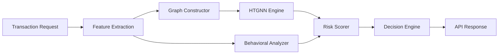
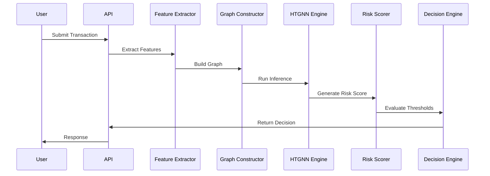

# System Architecture

## Overview

AegisGraph Sentinel 2.0 is a real-time fraud detection platform designed to identify mule account networks and suspicious financial activities using Heterogeneous Temporal Graph Neural Networks (HTGNN).

The system combines graph analytics, behavioral biometrics, transaction analysis, and explainable AI to make fraud decisions within the critical transaction authorization window.

---

# High-Level Architecture



---

# Core Components

## 1. Feature Extraction Layer

The Feature Extraction Layer converts raw transaction information into machine-readable features.

Responsibilities:

- Transaction amount analysis
- Velocity calculations
- Entropy calculations
- Device profiling
- Behavioral biometrics extraction
- Historical pattern extraction

Location:

```text
src/features/
```

Modules:

- behavioral_biometrics.py
- velocity_calculator.py
- entropy_calculator.py
- honeypot_escrow.py
- predictive_mule_identification.py
- voice_stress_analysis.py
- blockchain_evidence.py
- aegis_oracle_explainer.py

---

## 2. Graph Constructor

The Graph Constructor creates a dynamic graph representation of financial relationships.

Node Types:

- Account
- Device
- ATM
- Merchant
- IP Address

Edge Types:

- Transfer
- Login
- Withdrawal
- Association

Responsibilities:

- Graph generation
- Neighbor extraction
- Relationship tracking
- Temporal graph building

---

## 3. HTGNN Engine

The Heterogeneous Temporal Graph Neural Network performs advanced fraud detection using graph structures.

Responsibilities:

- Node embedding generation
- Graph attention computation
- Temporal relationship learning
- Risk representation learning

Benefits:

- Detects hidden fraud patterns
- Identifies mule account chains
- Discovers suspicious clusters

---

## 4. Behavioral Analysis Layer

This layer analyzes user behavior during transaction execution.

Features:

- Keystroke timing
- Hold times
- Flight times
- Voice stress analysis

Purpose:

Detect social engineering and coercion-based fraud attempts.

---

## 5. Risk Scoring Engine

Combines outputs from multiple subsystems.

Inputs:

- HTGNN score
- Velocity score
- Behavioral score
- Device score
- Historical risk indicators

Outputs:

- Risk Score (0–1)
- Risk Level
- Confidence Score

---

## 6. Decision Engine

Converts risk scores into actions.

Possible Decisions:

| Risk Range | Action |
|------------|----------|
| Low | Allow |
| Medium | Review |
| High | Block |

---

# Transaction Lifecycle



---

# Benefits of Graph-Based Detection

Traditional systems evaluate transactions individually.

AegisGraph Sentinel evaluates:

- Connected entities
- Historical relationships
- Transaction chains
- Behavioral anomalies
- Device sharing patterns

This enables detection of sophisticated fraud networks that rule-based systems often miss.