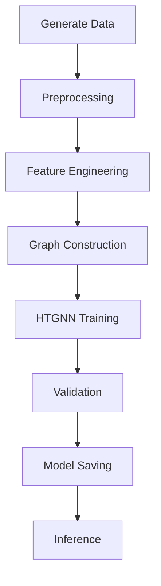

# Training Workflow

This document explains how models are trained within AegisGraph Sentinel 2.0.

---

# Training Pipeline Overview



---

# Step 1: Data Generation

Synthetic financial transaction data is generated.

Command:

```bash
python -m src.data.data_generator
```

Generated data contains:

- Accounts
- Devices
- Transactions
- IP addresses
- Fraud labels

---

# Step 2: Feature Engineering

Raw data is converted into machine-learning features.

Examples:

- Transaction frequency
- Average amount
- Velocity score
- Device risk indicators
- Entropy score

---

# Step 3: Graph Construction

A graph structure is created.

Nodes:

- Accounts
- Devices
- Merchants
- ATMs
- IPs

Edges:

- Transfers
- Logins
- Associations

---

# Step 4: HTGNN Training

The graph is passed through the HTGNN model.

Responsibilities:

- Learn hidden relationships
- Learn fraud patterns
- Generate embeddings

Training command:

```bash
python -m src.training.trainer
```

---

# Step 5: Validation

Model performance is evaluated.

Metrics:

- Precision
- Recall
- F1 Score
- ROC-AUC

Goal:

Ensure generalization to unseen fraud patterns.

---

# Step 6: Model Saving

Best-performing model is stored.

Example:

```text
models/htgnn_best.pt
```

---

# Step 7: Inference

Saved models are loaded for real-time fraud detection.

Inference Flow:

Transaction

↓

Feature Extraction

↓

Graph Construction

↓

HTGNN Prediction

↓

Risk Scoring

↓

Decision

---

# Best Practices

- Train using representative datasets
- Monitor validation metrics
- Save checkpoints regularly
- Evaluate false positives
- Track model drift

---

# Future Improvements

Potential future enhancements:

- Federated learning
- Online learning
- Distributed training
- Multi-bank graph federation
- Real-time retraining pipelines